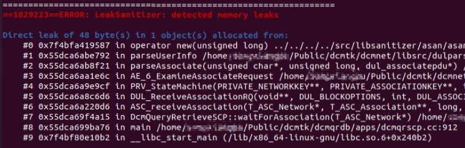

**Vulnerability Type:**  Memory Leak

**CVE Number**：CVE-2022-43272

**Vulnerability Version**：

* DCMTK 3.6.7 (* -> git commit 8399564)

**Fixed**：

* git commit [c34f4e46e](https://github.com/DCMTK/dcmtk/commit/c34f4e46e672ad21accf04da0dc085e43be6f5e1)

**Vulnerability Impact**：

The most obvious and immediate effect of a memory leak is to have less and less memory available on the system. Until all the available memory is used up eventually causing the system to crash with no available memory

**Function Stack Information**：

reproduce by ASAN

